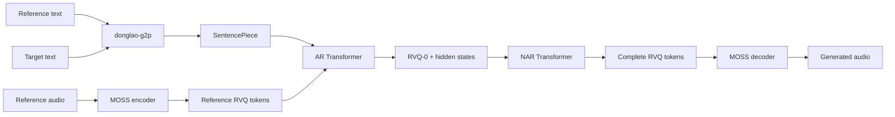

<div align="center">
  <p><strong>English</strong> · <a href="README.vi.md">Tiếng Việt</a></p>

  

  <h1>donglao-tts</h1>

  <p>
    <strong>An AR + NAR text-to-speech toolkit built on residual vector quantization.</strong>
  </p>

  <p>
    Train models, synthesize speech, publish Hugging Face bundles,<br>
    and deploy with PyTorch, ONNX, or OpenVINO.
  </p>

  <p>
    
    
    
    
    <a href="https://huggingface.co/DongLao/DongLao-TTS"></a>
  </p>
</div>

> [!IMPORTANT]
> `donglao-tts` is a **research/pre-1.0** project. This repository provides model and training
> tooling, not a complete TTS service. APIs may change between releases. Model weights are kept
> out of Git and distributed separately through [Hugging Face](https://huggingface.co/DongLao/DongLao-TTS).

## Table of contents

- [Overview](#overview)
- [Architecture](#architecture)
- [Features](#features)
- [Quick start](#quick-start)
- [Data preparation](#data-preparation)
- [Training](#training)
- [Inference](#inference)
- [Hugging Face Hub](#hugging-face-hub)
- [Export and quantization](#export-and-quantization)
- [Development](#development)
- [Security](#security)
- [Responsible use](#responsible-use)
- [Contributing](#contributing)
- [Roadmap](#roadmap)
- [License](#license)

## Overview

`donglao-tts` is a two-stage neural text-to-speech system:

- The **autoregressive (AR)** branch predicts the first RVQ layer frame by frame, conditioned on
  a reference voice and the target text.
- The **non-autoregressive (NAR)** branch predicts the remaining RVQ layers from the hidden
  states produced by the AR branch.
- [MOSS-Audio-Tokenizer-Nano](https://huggingface.co/OpenMOSS-Team/MOSS-Audio-Tokenizer-Nano)
  encodes audio into discrete codec tokens and decodes tokens back into waveforms.
- donglao-g2p and SentencePiece process Vietnamese, English, and code-switched text.

The project aims to provide a compact, testable codebase for training, inference, model export,
and quantization experiments with codec-based TTS.

## Architecture



The AR model supports two backbones:

| Backbone | Training | PyTorch inference | End-to-end ONNX |
|---|:---:|:---:|:---:|
| `custom` | ✅ | ✅ | ✅ Prefill + decode step |
| `qwen3` | ✅ | ✅ | ✅ Prefill + decode step |

## Features

- Joint AR + NAR training, with NAR gradients flowing back into the AR model.
- Speaker conditioning from reference audio and reference text.
- Temperature/top-k sampling and a KV cache for AR inference.
- Automatic checkpoint resume and checkpoint retention.
- Mixed precision with `float32`, `bf16`, and `fp16`.
- Quantization-Aware Training (QAT).
- ONNX Runtime and OpenVINO export.
- Dynamic INT8 weight-only quantization for ONNX.
- Safe model bundles based on `safetensors`.
- Push/load support for Hugging Face Hub model bundles.
- Experimental GGUF export for the Qwen3 AR backbone.
- Unit, numerical-parity, export, quantization, and security tests.

## Quick start

### Requirements

- Python `>=3.10,<3.11` (the first release is intentionally limited to the tested runtime)
- PyTorch and Torchaudio `>=2.11,<2.12`
- TorchCodec `>=0.12,<0.14` and FFmpeg 4-8 shared libraries for audio I/O
- Linux x86-64 is currently required because `donglao-g2p` publishes a Linux x86-64 wheel
- NVIDIA GPU and CUDA recommended for training
- Sufficient storage for datasets, the Hugging Face cache, and checkpoints

The first PyPI release is not published yet. For now, clone this repository and use the source
checkout instructions below. After the PyPI release, installation will be:

```bash
python -m pip install donglao-tts

# Or add it to a uv-managed project
uv add donglao-tts
```

The sampling and inference paths import `Pipeline` directly from the installed
[`donglao-g2p`](https://pypi.org/project/donglao-g2p/) distribution. To update it to the newest
compatible PyPI release:

```bash
python -m pip install --upgrade "donglao-g2p>=0.3,<0.4"
```

After the PyPI release, install only the runtime extras you need:

```bash
# ONNX and ONNX Runtime
python -m pip install "donglao-tts[export]"
uv add "donglao-tts[export]"

# OpenVINO
python -m pip install "donglao-tts[openvino]"

# Experimental GGUF support
python -m pip install "donglao-tts[gguf]"
```

For a source checkout, `uv` creates `.venv`, resolves `uv.lock`, and installs the project in
editable mode:

```bash
uv sync --group dev --all-extras
```

To refresh the locked G2P version later:

```bash
uv lock --upgrade-package donglao-g2p
uv sync
```

Verify the installation:

```bash
donglao-train --help
donglao-infer --help
python -m pytest -q
```

### Configuration

Create a local configuration from the template packaged with the distribution:

```bash
donglao-init-config configs/local.yaml
```

Important fields:

| Field | Description |
|---|---|
| `codec.repo_id` | Hugging Face repository containing the audio codec |
| `codec.revision` | Immutable commit SHA for codec weights and remote code |
| `codec.device` | `cuda` or `cpu` |
| `tokenizer.model_path` | SentencePiece model path |
| `model.ar.backbone` | `custom` or `qwen3` |
| `model.precision` | `float32`, `bf16`, or `fp16` |
| `train.datasets` | Independently compiled corpus directories |
| `train.checkpoint_dir` | Checkpoint output directory |
| `sample.*` | Reference audio/text, target text, and WAV output |

Paths in YAML are resolved from the **current working directory**. Run commands from the
repository root.

## Data preparation

### Default layout

```text
DATASET/
├── raw/
│   └── vieneu/
│       ├── metadata.csv
│       └── audio/
├── manifest/
│   ├── vieneu.jsonl
│   └── vieneu.phon.jsonl
└── tokenize/
    ├── text/corpus.txt
    └── models/spm.model
```

`metadata.csv` uses `|` as its delimiter:

```text
audio_path|speaker_id|text
DATASET/raw/vieneu/audio/0001.wav|speaker-01|Xin chào mọi người.
```

### Pipeline

These commands are installed with the package:

```bash
# Audio -> RVQ manifest
donglao-prepare-dataset \
  --config configs/local.yaml \
  --metadata DATASET/raw/vieneu/metadata.csv \
  --audio-root . \
  --output DATASET/manifest/vieneu.jsonl

# Add phonemes to the manifest
donglao-phonemize-manifest \
  --input DATASET/manifest/vieneu.jsonl \
  --output DATASET/manifest/vieneu.phon.jsonl \
  --lang vi

# Build the phoneme corpus
donglao-build-phoneme-corpus \
  --manifest DATASET/manifest/vieneu.jsonl vi \
  --output DATASET/tokenize/text/corpus.txt

# Train SentencePiece
donglao-build-tokenizer \
  --config configs/local.yaml \
  --input DATASET/tokenize/text/corpus.txt \
  --model-prefix DATASET/tokenize/models/spm
```

A phonemized manifest contains `id`, stable `source_id`, `speaker`, `text`, `phoneme`, and a
`[T, n_q]` codec matrix:

```json
{
  "id": 1,
  "source_id": "audio/0001.wav",
  "speaker": "speaker-01",
  "text": "Xin chào.",
  "phoneme": "...",
  "codec": [[1, 2, 3, 4, 5, 6, 7, 8]]
}
```

Repeat `--manifest PATH LANG` to build the tokenizer corpus from multiple sources. Compile the
phonemized manifests for training as shown below.

### Compile the training dataset

Compile JSONL manifests into memory-mapped codec and pre-tokenized text shards:

```bash
donglao-compile-dataset \
  --tokenizer DATASET/tokenize/models/spm.model \
  --output DATASET/compiled/libritts100 \
  --manifest DATASET/manifest/libritts100.phon.jsonl libritts100 en \
  --val-ratio 0.01 \
  --seed 42

donglao-compile-dataset \
  --tokenizer DATASET/tokenize/models/spm.model \
  --output DATASET/compiled/vieneu \
  --manifest DATASET/manifest/vieneu.phon.jsonl vieneu vi \
  --val-ratio 0.01 \
  --seed 42
```

Set both directories under `train.datasets`. Each compiled directory contains one corpus and
any number of immutable shards. To add data without rewriting old shards, run the same command
with `--append`, the existing output directory, and the same stable corpus name.

`train.max_frames_per_batch` limits the sum of target and reference codec frames. The dataloader
automatically uses fewer samples for long batches, up to `train.batch_size`.

For a single end-to-end raw audio conversion command, use
`python scripts/raw_to_compiled.py --help`. It supports persistent resumable staging and
incremental `--append` without re-encoding utterances already present in the corpus catalog.

> [!WARNING]
> Do not commit private audio, transcripts, manifests, internal tokenizers, or codec tokens.
> `DATASET/` is already excluded by `.gitignore`.

## Training

```bash
# Automatically resume the latest checkpoint
donglao-train --config configs/local.yaml

# Start a new run
donglao-train --config configs/local.yaml --resume none

# Resume a specific checkpoint
donglao-train \
  --config configs/local.yaml \
  --resume run/step_120000.pt
```

Select a GPU:

```bash
CUDA_VISIBLE_DEVICES=0 donglao-train --config configs/local.yaml
```

`train.sh` is an example wrapper and currently sets `CUDA_VISIBLE_DEVICES=1`. Adjust it for your
environment before use.

### Quantization-Aware Training

Recommended workflow:

1. Train in fp32 or bf16 until convergence.
2. Create a separate configuration with `train.qat: true`.
3. Resume a trusted checkpoint and run a short QAT fine-tune.
4. Call `extract_plain_state_dict` before ONNX export or post-training quantization.

QAT forces computation to `float32`. Do not toggle QAT within the same training run.

## Inference

Set `sample.ref_audio`, `sample.ref_text`, `sample.target_text`, and `sample.output_path`, then run:

```bash
donglao-infer \
  --config configs/local.yaml \
  --device cuda
```

Run repeated generation for benchmarking:

```bash
donglao-infer \
  --config configs/local.yaml \
  --device cuda \
  --benchmark 10
```

The CLI loads the latest checkpoint from `train.checkpoint_dir`. Generated audio is written to
`sample.output_path`; codec-round-tripped reference audio is saved as `ref.wav` beside it.

Without a checkpoint, the CLI only validates the inference plumbing with randomly initialized
weights. It will not produce meaningful speech.

## Hugging Face Hub

A complete model release contains the native PyTorch `safetensors` weights, ONNX graphs, the
SentencePiece tokenizer, and a revision-pinned MOSS codec snapshot. Install the export extra
before packaging:

```bash
python -m pip install -e ".[export]"
hf auth login
hf auth whoami

donglao-push-to-hub \
  --config configs/local.yaml \
  --checkpoint run/step_120000.pt \
  --repo-id DongLao/DongLao-TTS \
  --out-dir run/hub-bundle
```

Add `--private` for a non-public model. The command downloads the exact MOSS snapshot selected by
`codec.repo_id` and `codec.revision`, copies its weights/config/custom code/license into the
bundle, exports ONNX, and then uploads everything. Prefer `hf auth login` over putting tokens in
commands or shell history, and never put `HF_TOKEN` in the bundle.

Recommended Python API:

```python
from donglao_tts import DongLaoTTS

tts = DongLaoTTS.from_pretrained(
    "DongLao/DongLao-TTS",
    device="cuda",  # omit to auto-detect
)

waveform = tts.generate(
    "Text to synthesize.",
    reference_audio="reference.wav",
    reference_text="Exact transcript of the reference recording.",
    output_path="output.wav",
)

print(tts.revision, tts.sample_rate, waveform.shape)
```

`from_pretrained` resolves branches and tags to an immutable commit before downloading. Reuse the
same `tts` object for multiple calls so the models and G2P pipeline are loaded only once. The
returned waveform is a CPU `torch.Tensor`; `output_path` is optional.

The low-level loader remains available for applications that manage the generation loop:

```python
from donglao_tts.hub import load_from_hub

(
    ar_model,
    nar_model,
    codec,
    sentencepiece,
    special_tokens,
    codebook_size,
    num_quantizers,
) = load_from_hub(
    "DongLao/DongLao-TTS",
    revision="<COMMIT_SHA>",
    device="cuda",
)
```

After installing from PyPI, verify the installed package against the current Hub commit:

```bash
donglao-smoke-test-hub \
  --repo-id DongLao/DongLao-TTS \
  --device cpu
```

This resolves and prints the exact commit, validates the bundle manifest, downloads the files,
then constructs AR, NAR, SentencePiece, and the bundled MOSS codec. For an end-to-end synthesis
test, provide a consented reference recording and its exact transcript:

```bash
donglao-smoke-test-hub \
  --repo-id DongLao/DongLao-TTS \
  --device cuda \
  --ref-audio reference.wav \
  --ref-text "Exact transcript of the reference recording." \
  --target-text "Text to synthesize." \
  --output hub-smoke-test.wav
```

Bundle contents:

```text
config.json
spm.model
ar_model.safetensors
nar_model.safetensors
bundle_manifest.json
README.md
onnx/
├── nar_layer.onnx
├── ar_prefill.onnx              # custom backbone
├── ar_decode_step.onnx          # custom backbone
├── ar_qwen3_prefill.onnx        # qwen3 backbone
└── ar_qwen3_decode_step.onnx    # qwen3 backbone
moss_codec/
├── config.json
├── model*.safetensors
├── configuration_moss_audio_tokenizer.py
├── modeling_moss_audio_tokenizer.py
└── ... remaining upstream snapshot/license files
```

`load_from_hub` prefers the bundled MOSS codec, so first use only downloads the single
`DongLao/DongLao-TTS` model repository. Legacy bundles without `moss_codec/` remain compatible
and download the codec separately through `codec.repo_id`.

For both `custom` and `qwen3`, the exporter produces AR prefill, AR decode-step, and NAR graphs.
Qwen3 uses a tensor adapter for `DynamicCache`; `position_ids` is an explicit decode-graph input
so `past_len` stays dynamic. The lightweight embedding lookup and sampling/EOS loop remain under
the Python/PyTorch driver.

## Export and quantization

### ONNX

Export the `custom` backbone:

```python
from donglao_tts.export.onnx_export import (
    export_ar_decode_step,
    export_ar_prefill,
    export_nar_layer,
)

d_model = cfg["model"]["d_model"]

export_ar_prefill(ar_model, "run/export/ar_prefill.onnx", d_model)
export_ar_decode_step(ar_model, "run/export/ar_decode_step.onnx", d_model)
export_nar_layer(nar_model, "run/export/nar_layer.onnx", d_model)
```

For the `qwen3` backbone, replace the two AR functions with:

```python
from donglao_tts.export.onnx_export import (
    export_ar_qwen3_decode_step,
    export_ar_qwen3_prefill,
)

export_ar_qwen3_prefill(ar_model, "run/export/ar_qwen3_prefill.onnx", d_model)
export_ar_qwen3_decode_step(ar_model, "run/export/ar_qwen3_decode_step.onnx", d_model)
```

`OnnxARGenerator` and `OnnxNARGenerator` in `onnx_generate.py` provide the ONNX Runtime driver.

### OpenVINO

```python
from donglao_tts.export.openvino_export import export_all_openvino

paths = export_all_openvino(
    ar_model,
    nar_model,
    out_dir="run/openvino",
    d_model=cfg["model"]["d_model"],
    backbone=cfg["model"]["ar"]["backbone"],
)
```

OpenVINO compilation defaults to fp32 to preserve numerical parity.

### Dynamic INT8

```python
from donglao_tts.export.quantize import quantize_onnx_dynamic

quantize_onnx_dynamic(
    "run/export/ar_prefill.onnx",
    "run/export/ar_prefill.int8.onnx",
)
```

This is dynamic weight-only quantization, not static/calibrated post-training quantization.

### GGUF

GGUF export currently targets only the Qwen3 AR backbone and remains experimental. The resulting
file **cannot be executed by stock `llama-cli` or `llama-server`** because donglao-tts uses
`inputs_embeds`, a codec-specific output space, a separate NAR branch, and the MOSS decoder.

## Development

### Repository layout

```text
assets/                    Project artwork
configs/                   Training/inference configuration
scripts/                   Dataset and tokenizer utilities
src/donglao_tts/
├── cli/                   Console entry points
├── data/                  Dataset and collation
├── export/                ONNX, OpenVINO, PTQ, and GGUF
├── models/                AR, NAR, embeddings, and codec wrapper
├── checkpoint.py          Restricted checkpoint loading
├── generate.py            Generation pipeline
├── hub.py                 Model bundles and Hugging Face Hub
└── quantization.py        QAT utilities
tests/                     Unit, parity, export, and security tests
```

### Checks

```bash
python -m compileall -q src scripts tests
python -m pytest -q
python -m pip check
git diff --check
```

The test suite covers model components, precision, QAT, ONNX/OpenVINO parity, quantization, GGUF
metadata, and security boundaries. Results may depend on which optional dependencies are
installed.

## Security

Important trust boundaries:

- The MOSS codec requires `trust_remote_code=True`. `configs/base.yaml` pins that code to a
  commit SHA; review upstream changes before updating the revision.
- PyTorch `.pt` checkpoints are loaded through a restricted `weights_only=True` loader.
- Shared model bundles use `safetensors`.
- YAML is parsed with `yaml.safe_load`.
- Never write `HF_TOKEN` to source code, configuration files, logs, or model bundles.
- Do not use user-controlled upload directories as `checkpoint_dir`.

Do not disclose tokens, personal data, or sensitive proof-of-concept material in a public issue.
Report vulnerabilities through the private security channel configured by the repository
maintainers.

Release controls and documented audit exceptions are maintained in [SECURITY.md](SECURITY.md).

This repository does not provide authentication, rate limiting, upload scanning, multi-tenant
sandboxing, or network isolation. These controls are the responsibility of the deployment.

## Responsible use

Voice cloning can affect a speaker's privacy, identity, and safety.

- Use a voice only with appropriate consent.
- Disclose synthetic audio when the context could otherwise be misleading.
- Protect reference audio, transcripts, embeddings, and checkpoints as sensitive data.
- Apply suitable retention, encryption, and access-control policies.
- Review dataset licenses and applicable laws before training or deployment.
- Do not use this project for impersonation, fraud, harassment, or bypassing voice authentication.

## Contributing

Issues, bug reports, documentation improvements, and pull requests are welcome.

Suggested workflow:

1. Check the issue tracker to avoid duplicate work.
2. Fork the repository and create a focused branch.
3. Add or update tests for behavioral changes.
4. Run all checks listed under [Development](#development).
5. Open a pull request describing the problem, solution, limitations, and test results.

Keep pull requests focused. Do not commit generated artifacts, datasets, checkpoints, or secrets.
For substantial architectural changes, open a design issue before implementation.

## Roadmap

- [ ] Pretrained model release with a reproducible model card.
- [ ] Streaming or chunked inference.
- [ ] Production inference server and observability hooks.
- [x] Complete Qwen3 ONNX decode-step support.
- [ ] Static/calibrated post-training quantization.
- [ ] Migration from deprecated `torch.ao.quantization` APIs to TorchAO.
- [x] General-purpose CLI arguments for data preparation.
- [x] Reproducible `uv.lock`, protected CI/release workflows, and audited dependencies.

The roadmap describes direction, not delivery commitments.

## Acknowledgements

This project uses or integrates:

- [MOSS-Audio-Tokenizer-Nano](https://huggingface.co/OpenMOSS-Team/MOSS-Audio-Tokenizer-Nano)
- [PyTorch](https://pytorch.org/)
- [Hugging Face Transformers](https://github.com/huggingface/transformers)
- [SentencePiece](https://github.com/google/sentencepiece)
- [donglao-g2p](https://pypi.org/project/donglao-g2p/)
- [ONNX Runtime](https://onnxruntime.ai/)
- [OpenVINO](https://github.com/openvinotoolkit/openvino)

Names and dependency licenses remain the property of their respective authors.

## License

Source code is available under the [Apache License 2.0](LICENSE).

The repository license does not automatically grant rights to third-party datasets, pretrained
models, audio codecs, or speaker identities. Users are responsible for verifying those rights.
