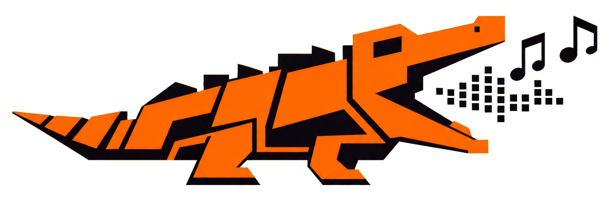
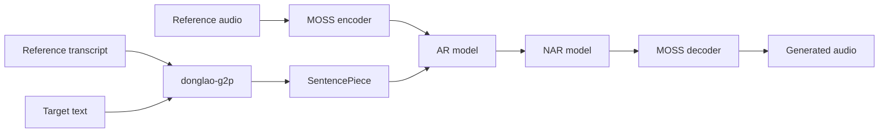

<div align="center">
  <p><strong>English</strong> · <a href="README.vi.md">Tiếng Việt</a></p>

  

  <h1>donglao-tts</h1>

  <p><strong>Reference-voice text-to-speech with a simple Python API.</strong></p>

  <p>
    
    
    
    <a href="https://huggingface.co/DongLao/DongLao-TTS"></a>
  </p>
</div>

> [!IMPORTANT]
> `donglao-tts` is a research/pre-1.0 release. APIs may change between versions. Use reference
> voices only with the speaker's permission.

## Recommended Python API

Install the package:

```bash
uv add donglao-tts

# Or with pip
python -m pip install donglao-tts
```

Load the published model and synthesize speech:

```python
from donglao_tts import DongLaoTTS

tts = DongLaoTTS.from_pretrained("DongLao/DongLao-TTS")

waveform = tts.generate(
    "Xin chào mọi người, đây là Đông Lào TTS.",
    reference_audio="reference.wav",
    reference_text="Exact transcript of the speech in reference.wav.",
    output_path="output.wav",
)

print("Model revision:", tts.revision)
print("Sample rate:", tts.sample_rate)
print("Waveform shape:", tuple(waveform.shape))
```

`from_pretrained()` automatically uses CUDA when available and otherwise uses CPU. It resolves
the selected model revision to an immutable commit before downloading the files. The first call
downloads the model, tokenizer, and bundled MOSS audio codec; later calls reuse the local cache.

Keep the `tts` object alive and reuse it for multiple requests:

```python
texts = [
    "Xin chào mọi người.",
    "The model is loaded only once.",
    "Bạn có thể tổng hợp nhiều câu liên tiếp.",
]

for index, text in enumerate(texts):
    tts.generate(
        text,
        reference_audio="reference.wav",
        reference_text="Exact transcript of the speech in reference.wav.",
        output_path=f"outputs/result-{index}.wav",
    )
```

For reproducible production use, pin the tested model commit and select the device explicitly:

```python
tts = DongLaoTTS.from_pretrained(
    "DongLao/DongLao-TTS",
    revision="6ba3003ccb8d938c2a725a4117084492909c9419",
    device="cuda",
)
```

### Generation options

```python
waveform = tts.generate(
    "Text to synthesize.",
    reference_audio="reference.wav",
    reference_text="Exact reference transcript.",
    output_path="output.wav",  # optional
    max_frames=200,
    temperature=1.0,
    top_k=0,
)
```

| Argument | Description |
|---|---|
| `text` | Non-empty text to synthesize |
| `reference_audio` | Path to the consented reference WAV/FLAC file |
| `reference_text` | Exact transcript of the reference recording |
| `output_path` | Optional output audio path |
| `max_frames` | Maximum number of generated codec frames |
| `temperature` | Sampling temperature; `0` selects greedy decoding |
| `top_k` | Sampling cutoff; `0` disables top-k truncation |

The method returns a CPU `torch.Tensor` with shape `[channels, samples]`, whether or not an
`output_path` is supplied.

## Installation

Supported runtime:

- Python `>=3.10,<3.11`
- Linux x86-64
- PyTorch and TorchAudio `>=2.8.0,<3`
- A CUDA-capable GPU is recommended; CPU inference is supported

Create a dedicated environment with uv:

```bash
uv venv --python 3.10
uv pip install donglao-tts
```

Install from a source checkout when working on an unreleased version:

```bash
git clone https://github.com/DongLaoAI/donglao-tts.git
cd donglao-tts
uv sync --locked
```

## Reference audio

The model transfers voice characteristics from a reference recording.

- Use a clean recording with one speaker and minimal background noise.
- Provide the exact spoken transcript in `reference_text`.
- Avoid long silence, music, overlapping speakers, clipping, or heavy reverberation.
- Use only recordings you have permission to process.

An inaccurate transcript can reduce pronunciation quality and voice consistency.

## Verify the installation

Check that the installed package can download and construct the published model:

```bash
donglao-smoke-test-hub \
  --repo-id DongLao/DongLao-TTS \
  --device cpu
```

Run an end-to-end synthesis check:

```bash
donglao-smoke-test-hub \
  --repo-id DongLao/DongLao-TTS \
  --device cuda \
  --ref-audio reference.wav \
  --ref-text "Exact transcript of the reference recording." \
  --target-text "Text to synthesize." \
  --output smoke-test.wav
```

A successful run prints `PASS` after loading the AR model, NAR model, tokenizer, and MOSS codec.

## How it works



The AR model generates the first residual-vector-quantization layer and hidden states. The NAR
model fills the remaining codec layers, and the bundled MOSS codec converts them into audio.

## Troubleshooting

### CUDA was requested, but CUDA is not available

Remove `device="cuda"` to enable automatic device selection, or pass `device="cpu"`.

### PyTorch and TorchAudio version mismatch

Install matching PyTorch and TorchAudio releases. For example, use `torch==2.8.0` together with
`torchaudio==2.8.0`. DongLao TTS uses SoundFile for audio I/O and does not require TorchCodec.

### Reference audio does not exist

Pass an existing path. Relative paths are resolved from the process's current working directory.

### The model generated zero frames

Check the reference audio and transcript, then retry with a longer reference recording or a
different sampling temperature.

### First startup takes longer

The first call downloads the model bundle. Subsequent calls use the Hugging Face cache unless a
different revision is requested or the cache is cleared.

## Responsible use

Voice synthesis can affect a speaker's privacy, identity, and safety.

- Obtain appropriate consent before using a voice.
- Disclose synthetic audio when the context could otherwise be misleading.
- Protect reference audio and transcripts as sensitive data.
- Review applicable licenses and laws before deployment.
- Do not use the project for impersonation, fraud, harassment, or bypassing voice authentication.

See [SECURITY.md](SECURITY.md) for vulnerability reporting and trust boundaries.

## Contributing

Issues and focused pull requests are welcome. Before opening a pull request, run:

```bash
uv sync --locked --group dev --all-extras
uv run --locked ruff check src scripts tests
uv run --locked python -m pytest -q
uv pip check
```

Do not commit datasets, checkpoints, credentials, private audio, or generated model artifacts.

## Roadmap

- [ ] Streaming or chunked synthesis
- [ ] Production inference server and observability hooks
- [ ] More evaluation results and model-card examples
- [ ] Broader Python and platform support
- [x] Simple `DongLaoTTS.from_pretrained()` inference API
- [x] Complete AR + NAR + MOSS model bundle

Roadmap items describe direction, not delivery commitments.

## Acknowledgements

This project builds on [PyTorch](https://pytorch.org/),
[MOSS-Audio-Tokenizer-Nano](https://huggingface.co/OpenMOSS-Team/MOSS-Audio-Tokenizer-Nano),
[Hugging Face](https://huggingface.co/), [SentencePiece](https://github.com/google/sentencepiece),
and [donglao-g2p](https://pypi.org/project/donglao-g2p/).

## License

Source code is available under the [Apache License 2.0](LICENSE). Third-party models, codecs,
datasets, recordings, and speaker identities may have separate terms. Users are responsible for
verifying that they have the necessary rights.
