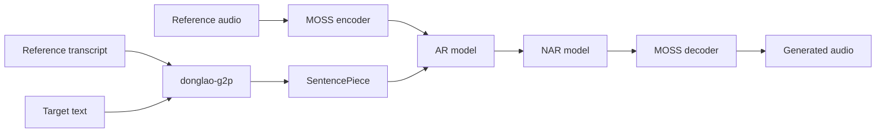

<div align="center">
  <p><strong>English</strong> · <a href="README.vi.md">Tiếng Việt</a></p>

  

  <h1>donglao-tts</h1>

  <p><strong>Reference-voice text-to-speech with a simple Python API.</strong></p>

  <p>
    
    
    
    <a href="https://huggingface.co/DongLao/DongLao-TTS"></a>
  </p>
</div>

> [!IMPORTANT]
> `donglao-tts` is a research/pre-1.0 release. APIs may change between versions. Use reference
> voices only with the speaker's permission.

## Recommended Python API

Install the package:

```bash
uv add donglao-tts

# Or with pip
python -m pip install donglao-tts
```

Load the published model and synthesize speech:

```python
from donglao_tts import DongLaoTTS

tts = DongLaoTTS.from_pretrained("DongLao/DongLao-TTS")

waveform = tts.generate(
    "Xin chào mọi người, đây là Đông Lào TTS.",
    reference_audio="reference.wav",
    reference_text="Exact transcript of the speech in reference.wav.",
    output_path="output.wav",
    leading_silence_ms=20,
    sentence_pause_ms=180,
    trailing_silence_ms=20,
)

print("Model revision:", tts.revision)
print("Sample rate:", tts.sample_rate)
print("Waveform shape:", tuple(waveform.shape))
```

`from_pretrained()` automatically uses CUDA when available and otherwise uses CPU. It resolves
the selected model revision to an immutable commit before downloading the files. The first call
downloads the model, tokenizer, and bundled MOSS audio codec; later calls reuse the local cache.

Keep the `tts` object alive and use the batch API for targets sharing one reference:

```python
texts = [
    "Xin chào mọi người.",
    "The model is loaded only once.",
    "Bạn có thể tổng hợp nhiều câu liên tiếp.",
]

waveforms = tts.generate_batch(
    texts,
    reference_audio="reference.wav",
    reference_text="Exact transcript of the speech in reference.wav.",
    output_paths=[f"outputs/result-{index}.wav" for index in range(len(texts))],
)
```

Batch inference phonemizes and encodes the shared reference once. AR/NAR generation remains
independent for each target. For codec-token streaming, consume each decoded RVQ chunk:

```python
for audio_chunk in tts.generate_stream(
    "The first sentence. The second sentence.",
    reference_audio="reference.wav",
    reference_text="Exact transcript of the speech in reference.wav.",
    chunk_frames=5,
):
    send_audio(audio_chunk, sample_rate=tts.sample_rate)
```

The AR model keeps its KV-cache and produces `chunk_frames` RVQ0 tokens at a time. NAR fills the
remaining RVQ layers for that group, then MOSS decodes and yields its waveform while AR generation
continues. The final group in a sentence may contain fewer frames. With the 12.5 Hz codec,
`chunk_frames=5` corresponds to approximately 400 ms of audio. Streaming emits silence as
separate chunks at the beginning, between period-delimited sentences, and at the end.

For reproducible production use, pin the tested model commit and select the device explicitly:

```python
tts = DongLaoTTS.from_pretrained(
    "DongLao/DongLao-TTS",
    revision="6ba3003ccb8d938c2a725a4117084492909c9419",
    device="cuda",
)
```

### Generation options

```python
waveform = tts.generate(
    "Text to synthesize.",
    reference_audio="reference.wav",
    reference_text="Exact reference transcript.",
    output_path="output.wav",  # optional
    max_frames=200,
    temperature=0.8,
    top_k=10,
    leading_silence_ms=20,
    sentence_pause_ms=180,
    trailing_silence_ms=20,
)
```

| Argument | Description |
|---|---|
| `text` | Non-empty text to synthesize |
| `reference_audio` | Path to the consented reference WAV/FLAC file |
| `reference_text` | Exact transcript of the reference recording |
| `output_path` | Optional output audio path |
| `max_frames` | Maximum number of generated codec frames |
| `temperature` | Sampling temperature; `0` selects greedy decoding |
| `top_k` | Sampling cutoff; `0` disables top-k truncation |
| `leading_silence_ms` | Silence before the first sentence; default `20` ms |
| `sentence_pause_ms` | Silence between period-delimited sentences; default `180` ms |
| `trailing_silence_ms` | Silence after the final sentence; default `20` ms |

After G2P conversion, the target is split on periods and each sentence is synthesized separately.
The sentence waveforms are concatenated in order with zero-valued silence of `20 / 180 / 20` ms
at the beginning / between sentences / at the end by default. Set any duration to `0` to disable
that padding. The method returns a CPU `torch.Tensor` with shape `[channels, samples]`, whether or
not an `output_path` is supplied.

## Installation

Supported runtime:

- Python `>=3.10,<3.11`
- Linux x86-64
- PyTorch and TorchAudio `>=2.8.0,<3`
- A CUDA-capable GPU is recommended; CPU inference is supported

Create a dedicated environment with uv:

```bash
uv venv --python 3.10
uv pip install donglao-tts
```

Install from a source checkout when working on an unreleased version:

```bash
git clone https://github.com/DongLaoAI/donglao-tts.git
cd donglao-tts
uv sync --locked
```

## How it works



The AR model generates the first residual-vector-quantization layer and hidden states. The NAR
model fills the remaining codec layers, and the bundled MOSS codec converts them into audio.

During training only, a learned 2x temporal upsampler and CTC head align AR target-frame hidden
states with the target SentencePiece sequence. A balanced auxiliary EOS loss strengthens the
existing EOS class. These auxiliary objectives update the AR representation but are not included
in native, ONNX, or Hugging Face inference bundles.

## Training and model export

Prepare the datasets and tokenizer paths in `configs/base.yaml`, then start or resume training:

```bash
sh train.sh                 # defaults to --resume auto
sh train.sh --resume none   # explicitly start a new run
```

The default training configuration enables the training-only objectives below:

```yaml
train:
  ctc_loss_weight: 0.1
  ctc_upsample_factor: 2
  ctc_warmup_steps: 5000
  eos_aux_loss_weight: 0.1

sample:
  leading_silence_ms: 20
  sentence_pause_ms: 180
  trailing_silence_ms: 20
```

Checkpoints contain optimizer and CTC state so training can resume exactly. The Hugging Face
publisher deliberately loads and exports only AR/NAR weights; datasets, optimizer state, CTC
head, training paths, and local sample configuration are excluded:

```bash
uv sync --locked --group dev --all-extras
sh scripts/push_to_hub.sh
```

The script publishes `checkpoints/run_02/step_90000.pt` to `DongLao/DongLao-TTS` by default and
does not require the `donglao-push-to-hub` console entry point to be installed. Override its
defaults by passing later CLI arguments, for example:

```bash
sh scripts/push_to_hub.sh \
  --checkpoint checkpoints/run_02/step_100000.pt \
  --repo-id DongLao/DongLao-TTS-Test \
  --private
```

The equivalent installed-package command is:

```bash
uv run donglao-push-to-hub \
  --config configs/base.yaml \
  --checkpoint checkpoints/run_02/step_100000.pt \
  --repo-id DongLao/DongLao-TTS \
  --out-dir release-bundle
```

Authentication is explicit through `HF_TOKEN` or a prior Hugging Face CLI login. Review the model
card, evaluation results, dataset terms, and generated bundle before publishing.

## Contributing

Issues and focused pull requests are welcome. Before opening a pull request, run:

```bash
uv sync --locked --group dev --all-extras
uv run --locked ruff check src scripts tests
uv run --locked python -m pytest -q
uv pip check
```

Do not commit datasets, checkpoints, credentials, private audio, or generated model artifacts.

## Roadmap

- [x] Streaming or chunked synthesis
- [ ] Production inference server and observability hooks
- [ ] More evaluation results and model-card examples
- [ ] Broader Python and platform support
- [x] Simple `DongLaoTTS.from_pretrained()` inference API
- [x] Complete AR + NAR + MOSS model bundle

Roadmap items describe direction, not delivery commitments.

## Acknowledgements

This project builds on [PyTorch](https://pytorch.org/),
[MOSS-Audio-Tokenizer-Nano](https://huggingface.co/OpenMOSS-Team/MOSS-Audio-Tokenizer-Nano),
[Hugging Face](https://huggingface.co/), [SentencePiece](https://github.com/google/sentencepiece),
and [donglao-g2p](https://pypi.org/project/donglao-g2p/).

## License

Source code is available under the [Apache License 2.0](LICENSE). Third-party models, codecs,
datasets, recordings, and speaker identities may have separate terms. Users are responsible for
verifying that they have the necessary rights.
