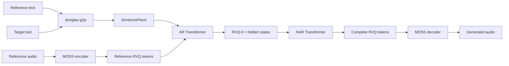

<div align="center">
  <p><a href="README.md">English</a> · <strong>Tiếng Việt</strong></p>

  

  <h1>donglao-tts</h1>

  <p>
    <strong>Toolkit Text-to-Speech AR + NAR dựa trên Residual Vector Quantization.</strong>
  </p>

  <p>
    Huấn luyện mô hình, tổng hợp giọng nói, đóng gói Hugging Face Hub<br>
    và triển khai qua PyTorch, ONNX hoặc OpenVINO.
  </p>

  <p>
    
    
    
    
    <a href="https://huggingface.co/DongLao/DongLao-TTS"></a>
  </p>
</div>

> [!IMPORTANT]
> `donglao-tts` đang ở giai đoạn **research/pre-1.0**. Repository cung cấp toolkit mô hình và
> huấn luyện, không phải một dịch vụ TTS hoàn chỉnh. API có thể thay đổi giữa các phiên bản.
> Weight được loại khỏi Git và phân phối riêng qua [Hugging Face](https://huggingface.co/DongLao/DongLao-TTS).

## Mục lục

- [Giới thiệu](#giới-thiệu)
- [Kiến trúc](#kiến-trúc)
- [Tính năng](#tính-năng)
- [Bắt đầu nhanh](#bắt-đầu-nhanh)
- [Chuẩn bị dữ liệu](#chuẩn-bị-dữ-liệu)
- [Huấn luyện](#huấn-luyện)
- [Inference](#inference)
- [Hugging Face Hub](#hugging-face-hub)
- [Export và quantization](#export-và-quantization)
- [Phát triển](#phát-triển)
- [Bảo mật](#bảo-mật)
- [Sử dụng có trách nhiệm](#sử-dụng-có-trách-nhiệm)
- [Đóng góp](#đóng-góp)
- [Roadmap](#roadmap)
- [Giấy phép](#giấy-phép)

## Giới thiệu

`donglao-tts` là hệ thống neural TTS hai giai đoạn:

- Nhánh **AR (autoregressive)** dự đoán lớp RVQ đầu tiên theo từng frame, có điều kiện từ
  reference voice và văn bản đích.
- Nhánh **NAR (non-autoregressive)** dự đoán các lớp RVQ còn lại từ hidden state của AR.
- [MOSS-Audio-Tokenizer-Nano](https://huggingface.co/OpenMOSS-Team/MOSS-Audio-Tokenizer-Nano)
  mã hóa audio thành discrete codec tokens và giải mã tokens về waveform.
- donglao-g2p và SentencePiece xử lý tiếng Việt, tiếng Anh và văn bản trộn mã.

Mục tiêu của dự án là cung cấp một codebase nhỏ, có thể kiểm thử và thuận tiện để thử nghiệm
training, inference, model export và quantization cho TTS dựa trên audio codec.

## Kiến trúc



AR hỗ trợ hai backbone:

| Backbone | Huấn luyện | PyTorch inference | ONNX end-to-end |
|---|:---:|:---:|:---:|
| `custom` | ✅ | ✅ | ✅ Prefill + decode-step |
| `qwen3` | ✅ | ✅ | ✅ Prefill + decode-step |

## Tính năng

- Joint AR + NAR training với gradient từ NAR truyền về AR.
- Speaker conditioning từ reference audio và reference text.
- Sampling bằng temperature/top-k và KV cache cho AR inference.
- Checkpoint resume và tự động giữ các checkpoint mới nhất.
- Mixed precision: `float32`, `bf16`, `fp16`.
- Quantization-Aware Training (QAT).
- ONNX Runtime và OpenVINO export.
- Dynamic INT8 weight-only quantization cho ONNX.
- Model bundle an toàn bằng `safetensors`.
- Push/load model bundle từ Hugging Face Hub.
- GGUF export thử nghiệm cho Qwen3 AR backbone.
- Unit, numerical-parity, export và security tests.

## Bắt đầu nhanh

### Yêu cầu

- Python `>=3.10,<3.11` (bản đầu giới hạn có chủ đích ở runtime đã kiểm thử)
- PyTorch và Torchaudio `>=2.11,<2.12`
- TorchCodec `>=0.12,<0.14` và thư viện chia sẻ FFmpeg 4-8 để đọc/ghi audio
- Hiện tại cần Linux x86-64 vì `donglao-g2p` mới phát hành wheel cho Linux x86-64
- NVIDIA GPU/CUDA được khuyến nghị cho training
- Đủ dung lượng cho dataset, Hugging Face cache và checkpoint

Bản PyPI đầu tiên chưa được phát hành. Hiện tại hãy clone repository và làm theo hướng dẫn cài
từ source bên dưới. Sau khi có bản PyPI, lệnh cài sẽ là:

```bash
python -m pip install donglao-tts

# Hoặc thêm vào project đang quản lý bằng uv
uv add donglao-tts
```

Luồng tạo sample và infer import trực tiếp `Pipeline` từ distribution
[`donglao-g2p`](https://pypi.org/project/donglao-g2p/) đã được cài. Để nâng lên bản PyPI tương
thích mới nhất:

```bash
python -m pip install --upgrade "donglao-g2p>=0.3,<0.4"
```

Sau khi có bản PyPI, cài runtime extras theo nhu cầu:

```bash
# ONNX + ONNX Runtime
python -m pip install "donglao-tts[export]"
uv add "donglao-tts[export]"

# OpenVINO
python -m pip install "donglao-tts[openvino]"

# GGUF thử nghiệm
python -m pip install "donglao-tts[gguf]"
```

Trong source checkout, `uv` tự tạo `.venv`, resolve `uv.lock` và cài project ở editable mode:

```bash
uv sync --group dev --all-extras
```

Để cập nhật phiên bản G2P trong lockfile về sau:

```bash
uv lock --upgrade-package donglao-g2p
uv sync
```

Xác minh cài đặt:

```bash
donglao-train --help
donglao-infer --help
python -m pytest -q
```

### Cấu hình

Tạo cấu hình riêng từ template được đóng gói cùng distribution:

```bash
donglao-init-config configs/local.yaml
```

Các trường chính:

| Trường | Mô tả |
|---|---|
| `codec.repo_id` | Hugging Face repository của audio codec |
| `codec.revision` | Commit SHA bất biến của codec và remote code |
| `codec.device` | `cuda` hoặc `cpu` |
| `tokenizer.model_path` | SentencePiece model |
| `model.ar.backbone` | `custom` hoặc `qwen3` |
| `model.precision` | `float32`, `bf16` hoặc `fp16` |
| `train.datasets` | Danh sách các corpus đã compile độc lập |
| `train.checkpoint_dir` | Thư mục lưu checkpoint |
| `sample.*` | Reference audio/text, target text và output WAV |

Đường dẫn trong YAML được resolve theo **working directory**. Chạy các lệnh từ thư mục gốc của
repository.

## Chuẩn bị dữ liệu

### Bố cục mặc định

```text
DATASET/
├── raw/
│   └── vieneu/
│       ├── metadata.csv
│       └── audio/
├── manifest/
│   ├── vieneu.jsonl
│   └── vieneu.phon.jsonl
└── tokenize/
    ├── text/corpus.txt
    └── models/spm.model
```

`metadata.csv` sử dụng dấu `|`:

```text
audio_path|speaker_id|text
DATASET/raw/vieneu/audio/0001.wav|speaker-01|Xin chào mọi người.
```

### Pipeline

```bash
# Audio -> RVQ manifest
donglao-prepare-dataset \
  --config configs/local.yaml \
  --metadata DATASET/raw/vieneu/metadata.csv \
  --audio-root . \
  --output DATASET/manifest/vieneu.jsonl

# Thêm phoneme vào manifest
donglao-phonemize-manifest \
  --input DATASET/manifest/vieneu.jsonl \
  --output DATASET/manifest/vieneu.phon.jsonl \
  --lang vi

# Tạo phoneme corpus
donglao-build-phoneme-corpus \
  --manifest DATASET/manifest/vieneu.jsonl vi \
  --output DATASET/tokenize/text/corpus.txt

# Huấn luyện SentencePiece
donglao-build-tokenizer \
  --config configs/local.yaml \
  --input DATASET/tokenize/text/corpus.txt \
  --model-prefix DATASET/tokenize/models/spm
```

Manifest sau phonemization gồm `id`, `source_id` ổn định, `speaker`, `text`, `phoneme` và ma trận
codec `[T, n_q]`:

```json
{
  "id": 1,
  "source_id": "audio/0001.wav",
  "speaker": "speaker-01",
  "text": "Xin chào.",
  "phoneme": "...",
  "codec": [[1, 2, 3, 4, 5, 6, 7, 8]]
}
```

Lặp lại `--manifest PATH LANG` để tạo corpus tokenizer từ nhiều nguồn. Manifest phoneme sau đó
được compile thành dataset training như phần dưới.

### Compile dataset để training

Manifest JSONL là dữ liệu trung gian, không được đọc trực tiếp trong vòng lặp training. Compile
codec và phoneme token thành các shard memory-map:

```bash
donglao-compile-dataset \
  --tokenizer DATASET/tokenize/models/spm.model \
  --output DATASET/compiled/libritts100 \
  --manifest DATASET/manifest/libritts100.phon.jsonl libritts100 en \
  --val-ratio 0.01 \
  --seed 42

donglao-compile-dataset \
  --tokenizer DATASET/tokenize/models/spm.model \
  --output DATASET/compiled/vieneu \
  --manifest DATASET/manifest/vieneu.phon.jsonl vieneu vi \
  --val-ratio 0.01 \
  --seed 42
```

Sau đó cấu hình:

```yaml
train:
  datasets:
    - DATASET/compiled/libritts100
    - DATASET/compiled/vieneu
  batch_size: 16
  max_frames_per_batch: 3200
  bucket_size: 256
  reference_percentile: 90
```

`batch_size` là số sample tối đa. `max_frames_per_batch` là tổng số codec frame của target và
reference; dataloader tự giảm số sample khi batch có nhiều câu dài. Mọi utterance vẫn được dùng
làm target; mặc định chỉ 90% utterance ngắn hơn của mỗi speaker được dùng làm voice reference để
tránh prompt quá dài làm chậm toàn batch.

Để thêm corpus mà không encode hoặc ghi lại các shard cũ:

```bash
donglao-compile-dataset \
  --append \
  --tokenizer DATASET/tokenize/models/spm.model \
  --output DATASET/compiled/vieneu \
  --manifest DATASET/manifest/vieneu-new.phon.jsonl vieneu vi \
  --val-ratio 0.01 \
  --seed 42
```

Mỗi thư mục compiled chỉ chứa một corpus nhưng có thể có bao nhiêu shard tùy ý. Giữ nguyên tên
corpus, ngôn ngữ, tokenizer, codec, `--val-ratio` và `--seed` khi append. Shard mới chỉ được
công bố sau khi ghi và validate thành công.

### Một lệnh từ raw audio đến compiled dataset

Script [`scripts/raw_to_compiled.py`](scripts/raw_to_compiled.py) chạy toàn bộ normalize, G2P,
codec encode, tokenize và compile:

```bash
python scripts/raw_to_compiled.py \
  --config configs/base.yaml \
  --metadata DATASET/raw/vieneu/metadata.csv \
  --audio-root . \
  --corpus vieneu \
  --lang vi \
  --output DATASET/compiled/vieneu \
  --staging-manifest DATASET/staging/vieneu.phon.jsonl \
  --strict
```

Nếu tiến trình bị dừng trong lúc encode, chạy lại cùng lệnh và thêm `--resume-staging`. Những
audio đã có trong staging sẽ không bị encode lại.

Để thêm raw data mới vào corpus hiện có:

```bash
python scripts/raw_to_compiled.py \
  --config configs/base.yaml \
  --metadata /data/vieneu-new/metadata.csv \
  --audio-root /data/vieneu-new \
  --corpus vieneu \
  --lang vi \
  --output DATASET/compiled/vieneu \
  --staging-manifest DATASET/staging/vieneu-new.phon.jsonl \
  --append
```

Metadata dùng dấu `|` và cần `audio_path`, `speaker_id`, `text`. Có thể thêm cột `source_id` ổn
định; nếu không có, script dùng nguyên giá trị `audio_path` để nhận diện và chống trùng.

Trên máy khác, cài project trước bằng `python -m pip install -e /path/to/donglao_tts`, sau đó có
thể chạy hoặc copy riêng script này. Máy đích cần config, SentencePiece model, metadata/audio và
quyền tải codec model ở lần chạy đầu.

> [!WARNING]
> Không commit audio, transcript riêng tư, manifest, tokenizer nội bộ hoặc codec tokens.
> `DATASET/` đã được thêm vào `.gitignore`.

## Huấn luyện

```bash
# Tự resume checkpoint mới nhất
donglao-train --config configs/local.yaml

# Bắt đầu run mới
donglao-train --config configs/local.yaml --resume none

# Resume checkpoint cụ thể
donglao-train \
  --config configs/local.yaml \
  --resume run/step_120000.pt
```

Chọn GPU:

```bash
CUDA_VISIBLE_DEVICES=0 donglao-train --config configs/local.yaml
```

`train.sh` là wrapper mẫu và hiện đặt `CUDA_VISIBLE_DEVICES=1`; hãy chỉnh theo môi trường.

### Quantization-Aware Training

Quy trình khuyến nghị:

1. Huấn luyện fp32/bf16 đến khi hội tụ.
2. Tạo cấu hình QAT riêng với `train.qat: true`.
3. Resume từ checkpoint đáng tin cậy và fine-tune trong một run ngắn.
4. Dùng `extract_plain_state_dict` trước khi ONNX export hoặc PTQ.

QAT buộc compute về `float32` và không nên được bật/tắt giữa cùng một training run.

## Inference

Cập nhật `sample.ref_audio`, `sample.ref_text`, `sample.target_text` và `sample.output_path`:

```bash
donglao-infer \
  --config configs/local.yaml \
  --device cuda
```

Benchmark nhiều lần:

```bash
donglao-infer \
  --config configs/local.yaml \
  --device cuda \
  --benchmark 10
```

CLI sử dụng checkpoint mới nhất trong `train.checkpoint_dir`. Audio sinh ra được ghi vào
`sample.output_path`; audio reference sau codec round-trip được ghi thành `ref.wav` bên cạnh nó.

Nếu không có checkpoint, CLI chỉ kiểm tra inference plumbing bằng trọng số ngẫu nhiên. Kết quả
không phải tiếng nói có ý nghĩa.

## Hugging Face Hub

Một model release đầy đủ gồm trọng số PyTorch `safetensors`, graph ONNX, SentencePiece tokenizer
và snapshot MOSS codec đã khóa revision. Cài extra export trước khi đóng gói:

```bash
python -m pip install -e ".[export]"
hf auth login
hf auth whoami

donglao-push-to-hub \
  --config configs/local.yaml \
  --checkpoint run/step_120000.pt \
  --repo-id DongLao/DongLao-TTS \
  --out-dir run/hub-bundle
```

Thêm `--private` nếu model không public. Lệnh tải đúng snapshot MOSS được chỉ định bởi
`codec.repo_id` và `codec.revision`, sao chép cả weights/config/custom code/license vào bundle,
export ONNX rồi mới upload. Ưu tiên `hf auth login` thay vì đưa token vào câu lệnh hoặc shell
history, và không đưa `HF_TOKEN` vào bundle.

Python API được khuyến nghị:

```python
from donglao_tts import DongLaoTTS

tts = DongLaoTTS.from_pretrained(
    "DongLao/DongLao-TTS",
    device="cuda",  # bỏ tham số này để tự nhận diện
)

waveform = tts.generate(
    "Nội dung cần tổng hợp.",
    reference_audio="reference.wav",
    reference_text="Transcript chính xác của bản thu tham chiếu.",
    output_path="output.wav",
)

print(tts.revision, tts.sample_rate, waveform.shape)
```

`from_pretrained` resolve branch/tag thành commit bất biến trước khi tải. Hãy tái sử dụng cùng một
đối tượng `tts` cho nhiều lần gọi để model và G2P chỉ được load một lần. Waveform trả về là
`torch.Tensor` trên CPU; `output_path` là tùy chọn.

Low-level loader vẫn được giữ cho ứng dụng muốn tự quản lý vòng lặp generation:

```python
from donglao_tts.hub import load_from_hub

(
    ar_model,
    nar_model,
    codec,
    sentencepiece,
    special_tokens,
    codebook_size,
    num_quantizers,
) = load_from_hub(
    "DongLao/DongLao-TTS",
    revision="<COMMIT_SHA>",
    device="cuda",
)
```

Sau khi cài từ PyPI, kiểm tra package đã cài với commit hiện tại trên Hub:

```bash
donglao-smoke-test-hub \
  --repo-id DongLao/DongLao-TTS \
  --device cpu
```

Lệnh sẽ resolve và in commit chính xác, kiểm tra manifest, tải bundle, rồi dựng AR, NAR,
SentencePiece và MOSS codec đã đóng gói. Để test tổng hợp end-to-end, truyền một bản thu tham
chiếu được phép sử dụng cùng transcript chính xác của nó:

```bash
donglao-smoke-test-hub \
  --repo-id DongLao/DongLao-TTS \
  --device cuda \
  --ref-audio reference.wav \
  --ref-text "Transcript chính xác của bản thu tham chiếu." \
  --target-text "Nội dung cần tổng hợp." \
  --output hub-smoke-test.wav
```

Bundle gồm:

```text
config.json
spm.model
ar_model.safetensors
nar_model.safetensors
bundle_manifest.json
README.md
onnx/
├── nar_layer.onnx
├── ar_prefill.onnx              # custom backbone
├── ar_decode_step.onnx          # custom backbone
├── ar_qwen3_prefill.onnx        # qwen3 backbone
└── ar_qwen3_decode_step.onnx    # qwen3 backbone
moss_codec/
├── config.json
├── model*.safetensors
├── configuration_moss_audio_tokenizer.py
├── modeling_moss_audio_tokenizer.py
└── ... các file/license từ upstream snapshot
```

`load_from_hub` ưu tiên MOSS codec nằm trong bundle, vì vậy lần đầu sử dụng chỉ tải một model repo
`DongLao/DongLao-TTS`. Bundle cũ không có `moss_codec/` vẫn tương thích và tải codec riêng theo
`codec.repo_id`.

Với cả `custom` và `qwen3`, exporter tạo AR prefill, AR decode-step và NAR. Qwen3 sử dụng adapter
tensor cho `DynamicCache`; `position_ids` là input rõ ràng của decode graph để giữ `past_len` động.
Sampling/EOS loop và embedding lookup nhẹ vẫn do Python/PyTorch driver điều phối.

## Export và quantization

### ONNX

Export backbone `custom`:

```python
from donglao_tts.export.onnx_export import (
    export_ar_decode_step,
    export_ar_prefill,
    export_nar_layer,
)

d_model = cfg["model"]["d_model"]

export_ar_prefill(ar_model, "run/export/ar_prefill.onnx", d_model)
export_ar_decode_step(ar_model, "run/export/ar_decode_step.onnx", d_model)
export_nar_layer(nar_model, "run/export/nar_layer.onnx", d_model)
```

Với backbone `qwen3`, thay hai hàm AR bằng:

```python
from donglao_tts.export.onnx_export import (
    export_ar_qwen3_decode_step,
    export_ar_qwen3_prefill,
)

export_ar_qwen3_prefill(ar_model, "run/export/ar_qwen3_prefill.onnx", d_model)
export_ar_qwen3_decode_step(ar_model, "run/export/ar_qwen3_decode_step.onnx", d_model)
```

`OnnxARGenerator` và `OnnxNARGenerator` trong `onnx_generate.py` cung cấp inference driver.

### OpenVINO

```python
from donglao_tts.export.openvino_export import export_all_openvino

paths = export_all_openvino(
    ar_model,
    nar_model,
    out_dir="run/openvino",
    d_model=cfg["model"]["d_model"],
    backbone=cfg["model"]["ar"]["backbone"],
)
```

OpenVINO mặc định compile ở fp32 để giữ numerical parity.

### Dynamic INT8

```python
from donglao_tts.export.quantize import quantize_onnx_dynamic

quantize_onnx_dynamic(
    "run/export/ar_prefill.onnx",
    "run/export/ar_prefill.int8.onnx",
)
```

Đây là dynamic weight-only quantization, không phải static/calibrated PTQ.

### GGUF

GGUF export hiện chỉ dành cho Qwen3 AR backbone và mang tính thử nghiệm. File tạo ra **không chạy
được bằng stock `llama-cli` hoặc `llama-server`** vì donglao-tts sử dụng `inputs_embeds`, output
codec riêng, nhánh NAR và MOSS decoder.

## Phát triển

### Cấu trúc repository

```text
assets/                    Project artwork
configs/                   Training/inference configuration
scripts/                   Dataset and tokenizer utilities
src/donglao_tts/
├── cli/                   Console entry points
├── data/                  Dataset and collation
├── export/                ONNX, OpenVINO, PTQ and GGUF
├── models/                AR, NAR, embeddings and codec wrapper
├── checkpoint.py          Restricted checkpoint loading
├── generate.py            Generation pipeline
├── hub.py                 Model bundle and Hugging Face Hub
└── quantization.py        QAT utilities
tests/                     Unit, parity, export and security tests
```

### Chạy kiểm tra

```bash
python -m compileall -q src scripts tests
python -m pytest -q
python -m pip check
git diff --check
```

Test suite hiện bao phủ model components, precision, QAT, ONNX/OpenVINO parity, quantization,
GGUF metadata và security boundaries. Kết quả có thể phụ thuộc vào optional dependencies được
cài trong môi trường.

## Bảo mật

Các trust boundary chính:

- MOSS codec cần `trust_remote_code=True`. `configs/base.yaml` khóa remote code bằng commit SHA;
  review upstream diff trước khi thay đổi revision.
- Checkpoint `.pt` được nạp qua restricted loader với `weights_only=True`.
- Model bundle dùng `safetensors`.
- YAML được đọc bằng `yaml.safe_load`.
- `HF_TOKEN` không được ghi vào source, config, log hoặc model bundle.
- Không sử dụng đường dẫn upload của người dùng làm `checkpoint_dir`.

Không đăng token, dữ liệu cá nhân hoặc proof-of-concept nhạy cảm trong public issue. Hãy báo cáo
lỗ hổng qua kênh bảo mật riêng tư do maintainer của repository cấu hình.

Quy trình bảo vệ release và các audit exception được ghi tại [SECURITY.md](SECURITY.md).

Repository này không cung cấp authentication, rate limiting, upload scanning, multi-tenant
sandboxing hay network isolation. Các lớp bảo vệ đó thuộc trách nhiệm của hệ thống triển khai.

## Sử dụng có trách nhiệm

Voice cloning có thể ảnh hưởng đến quyền riêng tư, danh tính và an toàn của người nói.

- Chỉ sử dụng giọng nói khi có sự đồng ý phù hợp.
- Ghi rõ audio được tổng hợp khi ngữ cảnh có thể gây nhầm lẫn.
- Bảo vệ reference audio, transcript, embeddings và checkpoint như dữ liệu nhạy cảm.
- Áp dụng retention policy, encryption và access control.
- Kiểm tra giấy phép dataset và quy định pháp lý tại nơi vận hành.
- Không dùng dự án cho giả mạo, lừa đảo, quấy rối hoặc vượt qua hệ thống xác thực giọng nói.

## Đóng góp

Issue, bug report, documentation improvement và pull request đều được chào đón.

Quy trình đề xuất:

1. Kiểm tra issue tracker để tránh trùng lặp.
2. Fork repository và tạo branch có phạm vi rõ ràng.
3. Viết hoặc cập nhật test cho thay đổi hành vi.
4. Chạy toàn bộ kiểm tra trong phần [Phát triển](#phát-triển).
5. Mở pull request, mô tả vấn đề, giải pháp, giới hạn và kết quả test.

Giữ pull request nhỏ, không commit generated artefacts, dataset, checkpoint hoặc thông tin bí mật.
Với thay đổi kiến trúc lớn, nên mở issue thảo luận trước khi triển khai.

## Roadmap

- [ ] Pretrained model release và reproducible model card.
- [ ] Streaming/chunked inference.
- [ ] Production inference server và observability hooks.
- [x] Full Qwen3 ONNX decode-step support.
- [ ] Static/calibrated PTQ.
- [ ] Migration từ deprecated `torch.ao.quantization` sang TorchAO.
- [x] CLI tổng quát cho data preparation.
- [x] `uv.lock` tái lập, workflow CI/release được bảo vệ và dependency audit tự động.

Roadmap thể hiện định hướng, không phải cam kết thời hạn.

## Ghi nhận

Dự án sử dụng hoặc tích hợp:

- [MOSS-Audio-Tokenizer-Nano](https://huggingface.co/OpenMOSS-Team/MOSS-Audio-Tokenizer-Nano)
- [PyTorch](https://pytorch.org/)
- [Hugging Face Transformers](https://github.com/huggingface/transformers)
- [SentencePiece](https://github.com/google/sentencepiece)
- [donglao-g2p](https://pypi.org/project/donglao-g2p/)
- [ONNX Runtime](https://onnxruntime.ai/)
- [OpenVINO](https://github.com/openvinotoolkit/openvino)

Tên và giấy phép của các dependency thuộc về tác giả tương ứng.

## Giấy phép

Mã nguồn được phát hành theo [Apache License 2.0](LICENSE).

Giấy phép của repository không tự động cấp quyền sử dụng dataset, pretrained model, audio codec
hoặc giọng nói của bên thứ ba. Người sử dụng chịu trách nhiệm xác minh các quyền này.
