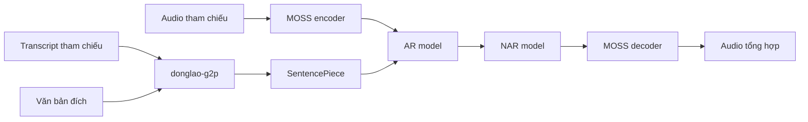

<div align="center">
  <p><a href="README.md">English</a> · <strong>Tiếng Việt</strong></p>

  

  <h1>donglao-tts</h1>

  <p><strong>Text-to-Speech theo giọng tham chiếu với Python API đơn giản.</strong></p>

  <p>
    
    
    
    <a href="https://huggingface.co/DongLao/DongLao-TTS"></a>
  </p>
</div>

> [!IMPORTANT]
> `donglao-tts` đang ở giai đoạn research/pre-1.0. API có thể thay đổi giữa các phiên bản. Chỉ
> sử dụng giọng tham chiếu khi có sự đồng ý của người nói.

## Python API khuyến nghị

Cài package:

```bash
uv add donglao-tts

# Hoặc dùng pip
python -m pip install donglao-tts
```

Tải model đã phát hành và tổng hợp giọng nói:

```python
from donglao_tts import DongLaoTTS

tts = DongLaoTTS.from_pretrained("DongLao/DongLao-TTS")

waveform = tts.generate(
    "Xin chào mọi người, đây là Đông Lào TTS.",
    reference_audio="reference.wav",
    reference_text="Transcript chính xác của nội dung trong reference.wav.",
    output_path="output.wav",
)

print("Model revision:", tts.revision)
print("Sample rate:", tts.sample_rate)
print("Waveform shape:", tuple(waveform.shape))
```

`from_pretrained()` tự sử dụng CUDA nếu khả dụng, nếu không sẽ chạy trên CPU. Branch hoặc tag
được resolve thành commit bất biến trước khi tải. Lần gọi đầu tải model, tokenizer và MOSS audio
codec đã đóng gói; những lần sau sử dụng Hugging Face cache.

Giữ đối tượng `tts` trong bộ nhớ và dùng batch API cho các target có cùng reference:

```python
texts = [
    "Xin chào mọi người.",
    "The model is loaded only once.",
    "Bạn có thể tổng hợp nhiều câu liên tiếp.",
]

waveforms = tts.generate_batch(
    texts,
    reference_audio="reference.wav",
    reference_text="Transcript chính xác của nội dung trong reference.wav.",
    output_paths=[f"outputs/result-{index}.wav" for index in range(len(texts))],
)
```

Batch inference chỉ phonemize và encode reference dùng chung một lần; phần sinh AR/NAR vẫn độc lập
cho từng target. Với codec-token streaming, xử lý từng RVQ chunk sau khi decode:

```python
for audio_chunk in tts.generate_stream(
    "Đây là câu thứ nhất. Đây là câu thứ hai.",
    reference_audio="reference.wav",
    reference_text="Transcript chính xác của nội dung trong reference.wav.",
    chunk_frames=5,
):
    send_audio(audio_chunk, sample_rate=tts.sample_rate)
```

AR giữ nguyên KV-cache và sinh mỗi lần `chunk_frames` token RVQ0. NAR điền các tầng RVQ còn lại
cho nhóm token đó, sau đó MOSS decode và trả waveform trong khi AR tiếp tục sinh. Nhóm cuối của
mỗi câu có thể ít frame hơn. Với codec 25 Hz, `chunk_frames=5` tương ứng khoảng 200 ms audio.

Trong production, nên khóa commit model đã kiểm thử và chỉ định device rõ ràng:

```python
tts = DongLaoTTS.from_pretrained(
    "DongLao/DongLao-TTS",
    revision="6ba3003ccb8d938c2a725a4117084492909c9419",
    device="cuda",
)
```

### Tùy chọn generation

```python
waveform = tts.generate(
    "Nội dung cần tổng hợp.",
    reference_audio="reference.wav",
    reference_text="Transcript chính xác của audio tham chiếu.",
    output_path="output.wav",  # không bắt buộc
    max_frames=200,
    temperature=0.8,
    top_k=10,
)
```

| Tham số | Ý nghĩa |
|---|---|
| `text` | Nội dung không rỗng cần tổng hợp |
| `reference_audio` | Đường dẫn WAV/FLAC tham chiếu được phép sử dụng |
| `reference_text` | Transcript chính xác của bản thu tham chiếu |
| `output_path` | Đường dẫn audio đầu ra, không bắt buộc |
| `max_frames` | Số codec frame sinh tối đa |
| `temperature` | Nhiệt độ sampling; `0` dùng greedy decoding |
| `top_k` | Ngưỡng sampling; `0` tắt top-k truncation |

Sau bước G2P, văn bản đích được tách theo dấu chấm và từng câu được sinh riêng. Các waveform của
từng câu được nối lại theo đúng thứ tự. Hàm trả về `torch.Tensor` trên CPU có shape
`[channels, samples]`, kể cả khi không truyền `output_path`.

## Cài đặt

Runtime được hỗ trợ:

- Python `>=3.10,<3.11`
- Linux x86-64
- PyTorch và TorchAudio `>=2.8.0,<3`
- Khuyến nghị GPU hỗ trợ CUDA; vẫn có thể inference bằng CPU

Tạo môi trường riêng với uv:

```bash
uv venv --python 3.10
uv pip install donglao-tts
```

Cài từ source khi cần sử dụng phiên bản chưa phát hành:

```bash
git clone https://github.com/DongLaoAI/donglao-tts.git
cd donglao-tts
uv sync --locked
```

## Cách hoạt động



AR sinh lớp residual-vector-quantization đầu tiên cùng hidden state. NAR điền các lớp codec còn
lại, sau đó MOSS codec trong model bundle chuyển chúng thành audio.

## Đóng góp

Issue và pull request có phạm vi rõ ràng đều được chào đón. Trước khi mở pull request, chạy:

```bash
uv sync --locked --group dev --all-extras
uv run --locked ruff check src scripts tests
uv run --locked python -m pytest -q
uv pip check
```

Không commit dataset, checkpoint, credential, audio riêng tư hoặc model artifact đã sinh.

## Roadmap

- [ ] Streaming hoặc chunked synthesis
- [ ] Inference server production và observability hook
- [ ] Bổ sung kết quả đánh giá và ví dụ model card
- [ ] Hỗ trợ thêm phiên bản Python và nền tảng
- [x] Python API đơn giản với `DongLaoTTS.from_pretrained()`
- [x] Model bundle hoàn chỉnh gồm AR + NAR + MOSS

Roadmap thể hiện định hướng, không phải cam kết thời hạn.

## Ghi nhận

Dự án xây dựng trên [PyTorch](https://pytorch.org/),
[MOSS-Audio-Tokenizer-Nano](https://huggingface.co/OpenMOSS-Team/MOSS-Audio-Tokenizer-Nano),
[Hugging Face](https://huggingface.co/), [SentencePiece](https://github.com/google/sentencepiece)
và [donglao-g2p](https://pypi.org/project/donglao-g2p/).

## Giấy phép

Mã nguồn được phát hành theo [Apache License 2.0](LICENSE). Model, codec, dataset, bản thu và danh
tính người nói của bên thứ ba có thể có điều khoản riêng. Người dùng chịu trách nhiệm xác minh
các quyền cần thiết.
